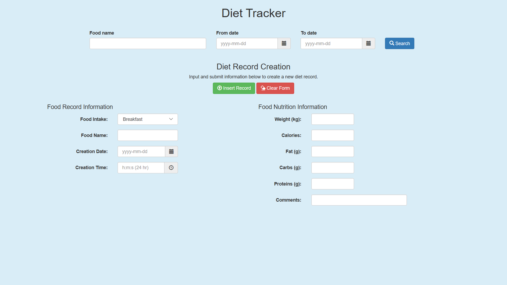
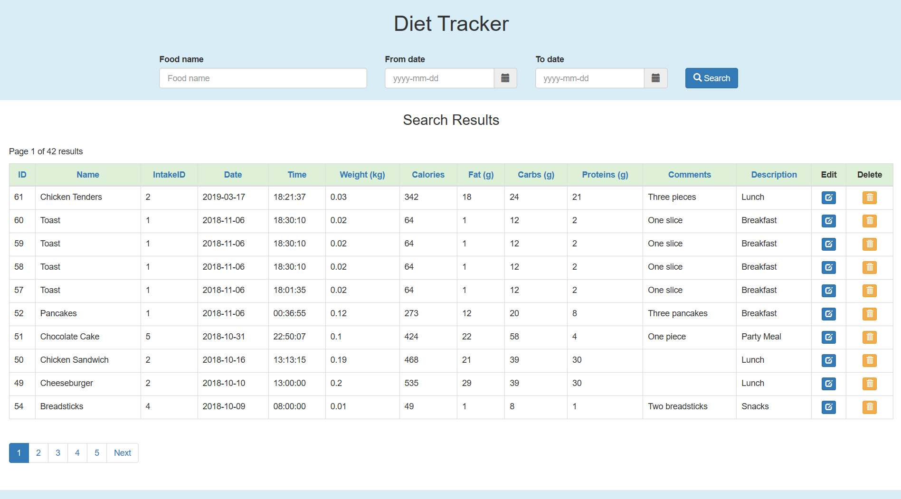
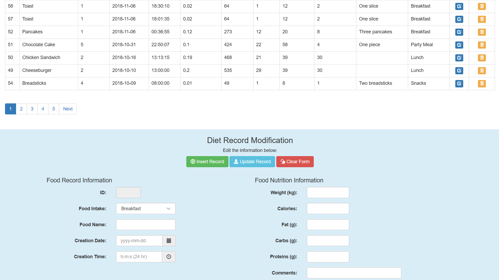

# Diet Tracker Project

This project is a sample database access website. It is designed to access a diet tracker database that can be edited via the website.

## Development Tools
* MySQL was used to create the diet tracker database.
* WampServer was used to generate the local server to run the diet tracker website.

## Credits
The website uses Bootstrap 3.4.1, jQuery 3.31, bootstrap-datepicker, and bootstrap-timepicker.
* [Bootstrap 3.4.1](https://getbootstrap.com/docs/3.4/)
* [jQuery 3.31](https://code.jquery.com/)
* [bootstrap-datepicker](https://cdnjs.com/libraries/bootstrap-datepicker)
* [bootstrap-timepicker](https://cdnjs.com/libraries/bootstrap-timepicker)

## Diet Tracker Website

### Diet Tracker Main Webpage

### Diet Tracker Search Results Webpage

